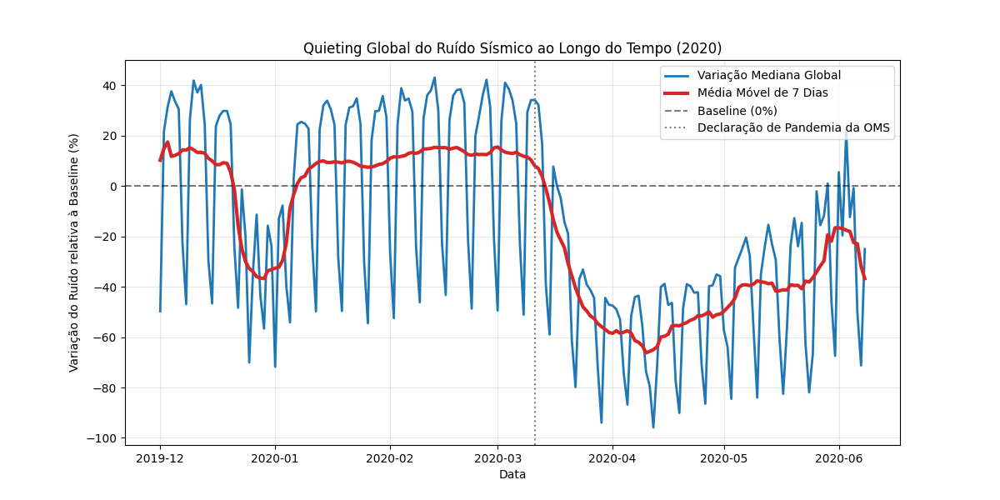
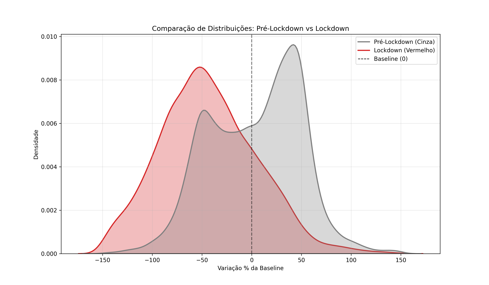
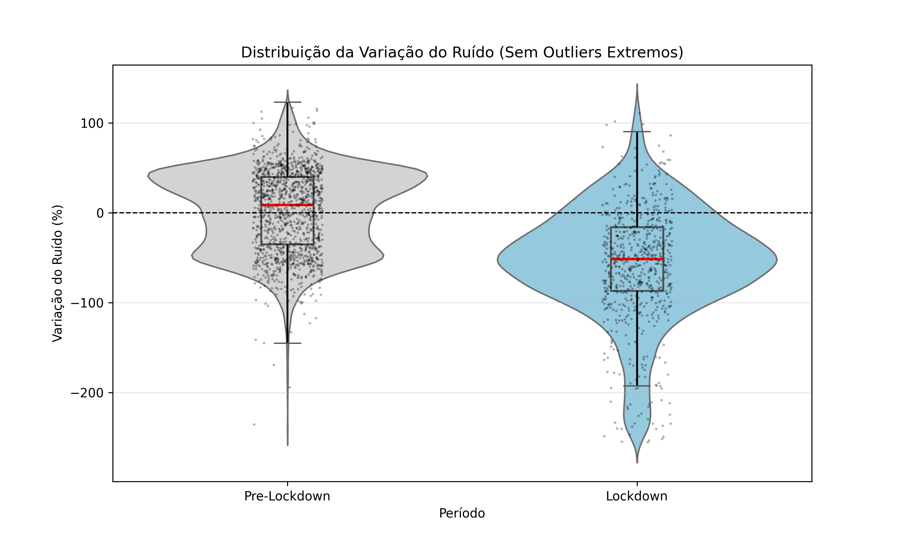
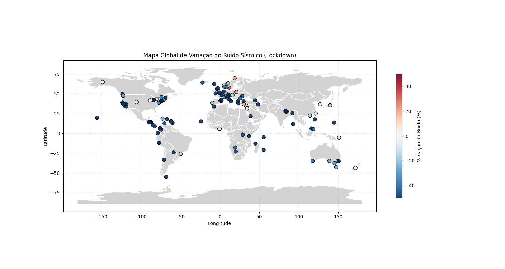
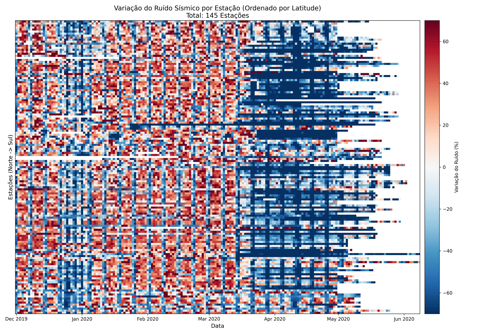
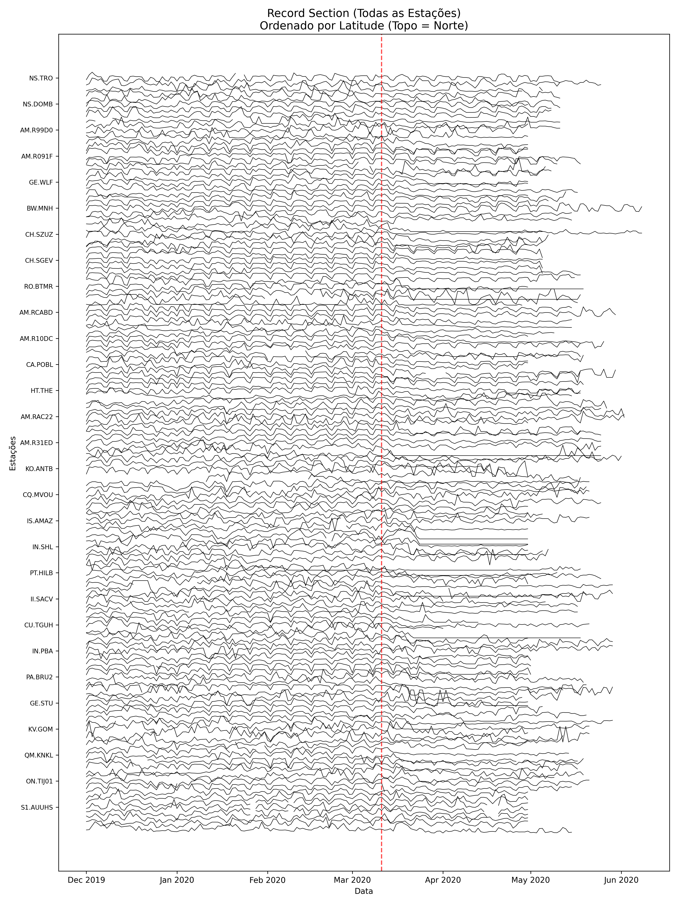
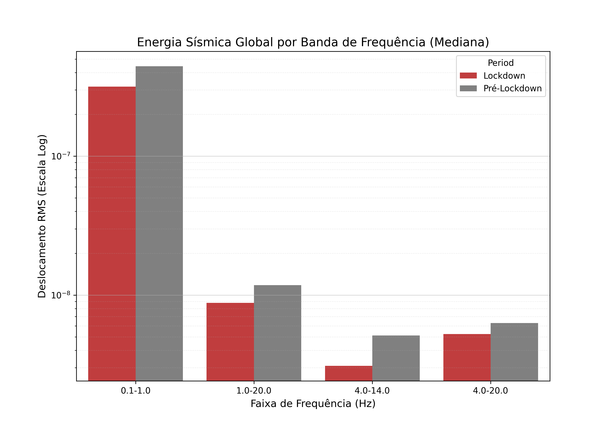
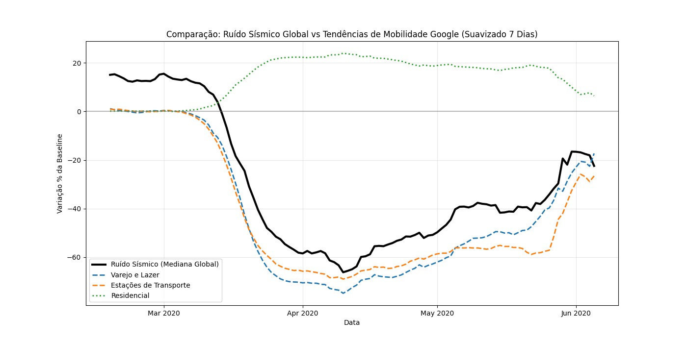
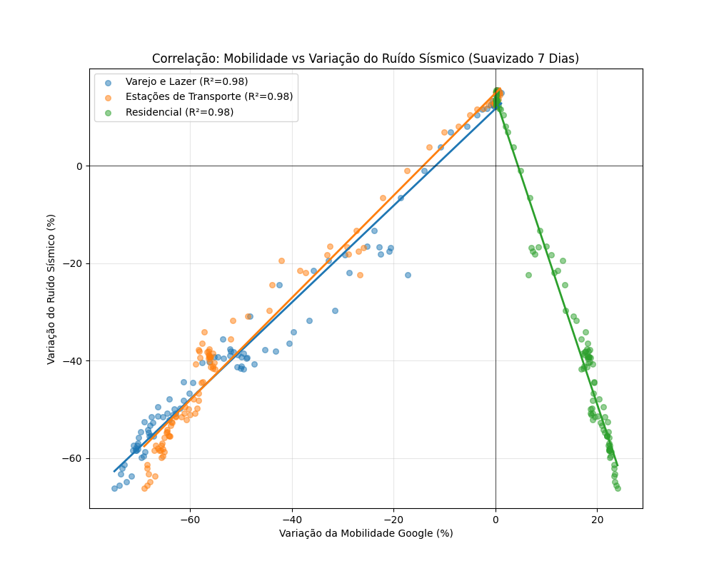
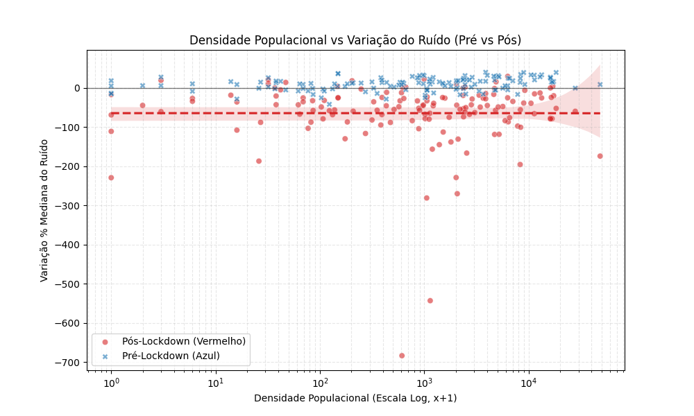

# The 2020 Seismic Noise "Global Quieting" Analysis

Este projeto reprodutível analisa o fenômeno do **"Global Quieting"** (Silenciamento Global) do ruído sísmico observado durante os lockdowns da pandemia de COVID-19 em 2020. Utlizando dados processados de estações sismológicas ao redor do mundo, investigamos como a redução da atividade humana impactou as vibrações de alta frequência da crosta terrestre.

## 1. Introdução e Contexto

Sismômetros são extremamente sensíveis e, além de terremotos, registram continuamente vibrações de fundo conhecidas como **ruído sísmico**. Em altas frequências (> 4 Hz), esse ruído é dominado por atividades antropogênicas (tráfego, indústrias, pessoas).

Com as medidas de isolamento social impostas globalmente a partir de março de 2020, observou-se uma queda drástica nesse ruído. Este estudo quantifica essa redução estatisticamente e espacialmente.

## 2. Dados e Variáveis Analisadas

Os dados primários consistem em séries temporais de deslocamento RMS (Root Mean Square) diário.

### Variável Base: Deslocamento RMS (`displacement_rms`)
Representa a energia média da vibração do solo em um dia.
*   **Unidade**: Metros (m) ou Nanometros (nm).
*   **Filtro**: Focamos na banda **4.0 - 14.0 Hz**, que é a "assinatura" da atividade humana.

### Variável de Estudo: Variação Percentual (`noise\_change\_pct`)
Para comparar estações com níveis de ruído muito diferentes (ex: uma estação urbana barulhenta vs uma rural silenciosa), normalizamos os dados calculando a variação percentual em relação a uma **Baseline**.

$$
\text{noise\_change\_pct} = \frac{\text{RMS}_{\text{dia}} - \text{RMS}_{\text{baseline}}}{\text{RMS}_{\text{baseline}}} \times 100
$$

*   **Baseline**: Mediana dos níveis de ruído em períodos anteriores (sem pandemia).
*   **Uso da Mediana**: Utilizamos a **mediana** ao invés da média para todas as agregações diárias. A mediana é uma medida estatística **robusta**, ou seja, não é afetada por *outliers* extremos (como um terremoto curto e intenso) que distorceriam a média do dia.

---

## 3. Metodologia Estatística e Hipóteses

Para validar cientificamente a mudança, aplicamos testes estatísticos rigorosos comparando dois períodos:
*   **Pré-Lockdown**: Dez/2019 a Fev/2020 (Normalidade).
*   **Lockdown**: Mar/2020 a Mai/2020 (Restrições).

### 3.1 Teste de Normalidade (Shapiro-Wilk)
Verifica se os dados de ruído seguem uma distribuição Gaussiana (Normal).
*   **H0 (Hipótese Nula)**: A distribuição dos dados É Normal.
*   **H1 (Hipótese Alternativa)**: A distribuição dos dados NÃO É Normal.
*   **Resultado**: p-valor < 0.05. **Rejeitamos H0**. Os dados de ruído sísmico não são normais (possuem caudas longas), justificando o uso de testes robustos e grandes amostras.

### 3.2 Teste T de Student (Comparação de Médias)
Verifica se houve uma mudança significativa no **nível médio** de ruído entre os períodos.
*   **H0**: Média(Pré) = Média(Pós). (O ruído não mudou).
*   **H1**: Média(Pré) $\neq$ Média(Pós). (Houve mudança significativa).
*   **Resultado**: p-valor $\ll$ 0.001. **Rejeitamos H0**. Confirmamos estatisticamente que o ruído diminuiu significativamente.

### 3.3 Teste F (Comparação de Variâncias)
Verifica se a **estabilidade** do ruído mudou. O ruído humano é caótico (variância alta); o ruído natural é constante (variância baixa).
*   **H0**: Variância(Pré) = Variância(Pós).
*   **H1**: Variância(Pré) $\neq$ Variância(Pós).
*   **Resultado**: p-valor $\ll$ 0.001. **Rejeitamos H0**. A variância caiu drasticamente, indicando que o ruído ambiente se tornou muito mais estável/constante durante o lockdown.

---

## 4. Resultados e Visualizações

### 4.1 Evolução Temporal Global
A série temporal abaixo mostra a mediana global da variação do ruído. Note a queda abrupta em Março de 2020, coincidindo com a declaração de pandemia da OMS.

### 4.2 Distribuições de Densidade (Pré vs Pós)
Comparando as distribuições de probabilidade (KDE), vemos claramente o "deslocamento para a esquerda" (negativo) da curva vermelha (Lockdown), indicando a redução geral da energia sísmica.
*   **Nota**: Os dados do período de festas (24/Dez a 02/Jan) foram removidos do conjunto "Pré-Lockdown" para evitar vieses de redução de ruído típicos de feriados.

### 4.2.1 Distribuição Detalhada (Violin Plot + Pontos)
Para uma visualização mais rica da distribuição dos dados, utilizamos um **Violin Plot** (formato de sino) com os pontos individuais sobrepostos.
*   **Variável Analisada**: `noise\_change\_pct` (Variação percentual do ruído em relação à baseline).
*   **Interpretação**: A largura do "sino" mostra a densidade de estações. Note como em "Lockdown" (Azul), o sino desce para valores negativos, indicando a redução generalizada do ruído. Os pontos pretos representam as estações individuais amostradas.

### 4.3 Visão Espacial: Distribuição das Mudanças
Mapa global mostrando a localização das estações e a variação média do ruído.
*   **Azul**: Estações onde o ruído **diminuiu** (maioria esmagadora).
*   **Vermelho**: Estações onde o ruído aumentou (raras).

### 4.4 Séries Temporais Detalhadas (Heatmap e Record Section)
Para visualizar todas as estações simultaneamente, ordenamos elas por Latitude (Norte -> Sul). A faixa azul vertical (Março-Maio) é consistente em quase todas as latitudes, provando que o fenômeno foi global, não local.

*(Acima: Heatmap. Abaixo: Record Section estilo sismograma)*

### 4.5 Análise Espectral (Bandas de Frequência)
Para confirmar que a causa é humana, separamos o ruído em bandas de frequência.
*   **4-14 Hz (Antropogênico)**: Queda drástica (barra vermelha).
*   **0.1-1.0 Hz (Oceânico)**: Energia muito maior, mas variação pequena (sazonal). O oceano não parou, as pessoas sim.

### 4.6 Causalidade: Correlação com Mobilidade
Confrontamos os dados sísmicos com os Relatórios de Mobilidade da Google (Apple/Google Mobility).
*   **Correlação Forte (Pearson r > 0.9)**: Entre Ruído e categorias "Varejo/Lazer", "Transporte" e "Trabalho".
*   **Correlação Negativa**: Entre Ruído e categoria "Residencial" (pessoas em casa = menos ruído na rua).

---

## 5. Conclusão

Este estudo confirma, com alto grau de confiança estatística, que o **"Global Quieting" de 2020 foi um evento sísmico único**, causado diretamente pela redução da atividade humana.
1.  O ruído caiu globalmente ~50% em áreas urbanas.
2.  A estabilidade do sinal sísmico aumentou drasticamente.
3.  A correlação direta com dados de mobilidade valida sismômetros como "proxies" de atividade social em tempo real.
